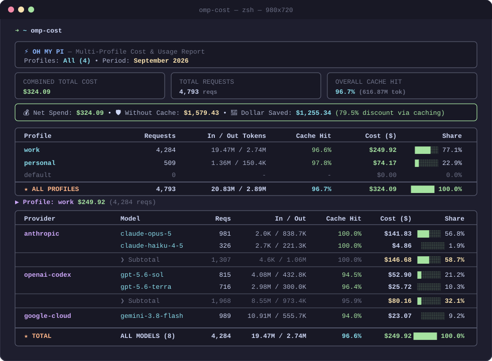

# ⚡ omp-cost

[](https://golang.org)
[](https://opensource.org/licenses/MIT)
[]()

<p align="center">
  
</p>

A fast, modern terminal utility and FinOps tool for inspecting AI token usage, prompt caching efficiency, and costs across **Oh My Pi** profiles by calendar month.

Built with **Go**, **Lipgloss**, **Cobra**, and **pure Go SQLite** (`modernc.org/sqlite` — 100% CGO-free).

---

## ✨ Features

- **Multi-Profile Aggregation:** Automatically detects all Oh My Pi profiles (`work`, `personal`, `default`, etc.) and displays a consolidated overview table alongside per-profile breakdowns.
- **True Calendar Month Filtering:** View costs by calendar month (e.g. `2026-09` from Sep 1 to current day, or full historical months like `2026-08`), replacing standard 30-day rolling windows.
- **Provider Subtotals:** Clear subtotals for each provider (`Anthropic`, `OpenAI Codex`, `Google Antigravity`, etc.) with model sorting by spend.
- **💰 Prompt Cache ROI Calculator (`--savings`):** Automatically computes dollar value saved via prompt caching and effective discount rate.
- **📁 Workspace / Project Attribution (`--by-project`):** Groups token usage and costs by repository or folder (e.g. `backend-api`, `frontend-web`, `infra-k8s`).
- **🤖 Agent Architecture Attribution (`--by-agent`):** Breaks down spending across the Main Orchestrator, Parallel Subagents, and Background Advisors.
- **⚡ Latency & Throughput Benchmark (`--perf`):** Evaluates average Time to First Token (TTFT), response duration, and output tokens/sec throughput per model.
- **🔥 Daily Burn Rate & Month-End Forecast (`--forecast`, `--budget`):** Calculates your daily run-rate, projected month-end spend, and budget cap warnings.
- **📊 Multiple Export Formats (`-o`):** Output as rich TUI (default), structured `JSON`, spreadsheet `CSV`, or GitHub-flavored `Markdown`.
- **⚡ Concurrent Session Syncing:** Syncs profile session files in parallel with Goroutines, reducing multi-profile sync times by over 75%. Also supports `--no-sync` for sub-20ms instant queries.

---

## 🚀 Installation

### One-Line Install (Recommended)
```bash
curl -fsSL https://raw.githubusercontent.com/faridlamaul/omp-cost/main/install.sh | bash
```

### From Source
```bash
git clone https://github.com/faridlamaul/omp-cost.git
cd omp-cost
make install
```

### Via `go install`
```bash
go install github.com/faridlamaul/omp-cost/cmd/omp-cost@latest
```

---

## 📖 Usage

### Quick Commands

```bash
# 1. Overview across all profiles for the current month
omp-cost

# 2. Detailed breakdown for a specific profile
omp-cost work
omp-cost personal

# 3. Specific profile for a specific month
omp-cost work 2026-08
omp-cost personal 2026-09

# 4. Summary of all profiles on a specific month
omp-cost all 2026-08
omp-cost 2026-08

# 5. Full monthly history for a specific profile
omp-cost work all

# 6. View daily breakdown for the current month
omp-cost work --daily

# 7. View weekly breakdown
omp-cost work --weekly

# 8. Filter for a specific day (today, yesterday, or YYYY-MM-DD)
omp-cost work today
omp-cost work yesterday
omp-cost work 2026-09-09

# 9. Launch interactive full-screen TUI dashboard
omp-cost -i
```

---

### Advanced Analytics Flags

#### 1. Workspace / Repository Attribution (`--by-project`)
```bash
omp-cost work --by-project
```
```text
📁 Project / Workspace Cost Attribution (--by-project)
┌──────────────────────────────────────┬────────────┬──────────────┬──────────────┬──────────────────┐
│ Workspace / Repository               │   Requests │       Tokens │     Cost ($) │            Share │
├──────────────────────────────────────┼────────────┼──────────────┼──────────────┼──────────────────┤
│ backend-api                          │      1,959 │      244.53M │      $142.75 │     ███░░░ 57.4% │
│ frontend-web                         │      2,101 │      306.54M │      $100.63 │     ██░░░░ 40.5% │
│ infra-k8s                            │        125 │       13.58M │       $2.081 │     ░░░░░░  0.8% │
└──────────────────────────────────────┴────────────┴──────────────┴──────────────┴──────────────────┘
```

#### 2. Agent Architecture Attribution (`--by-agent`)
```bash
omp-cost work --by-agent
```
```text
🤖 Agent Architecture Attribution (--by-agent)
┌──────────────────────────┬────────────┬────────────────┬──────────────┬──────────────────┐
│ Agent Role               │   Requests │         Tokens │     Cost ($) │            Share │
├──────────────────────────┼────────────┼────────────────┼──────────────┼──────────────────┤
│ Main Orchestrator        │      3,193 │        514.83M │      $216.69 │     █████░ 87.2% │
│ Parallel Subagent        │        781 │         52.70M │      $31.829 │     ░░░░░░ 12.8% │
│ Background Advisor       │        256 │              0 │        $0.00 │     ░░░░░░  0.0% │
└──────────────────────────┴────────────┴────────────────┴──────────────┴──────────────────┘
```

#### 3. Latency & Throughput Benchmark (`--perf`)
```bash
omp-cost work --perf
```
```text
⚡ Latency & Throughput Benchmark (--perf)
┌────────────────────────────────────────┬───────────┬──────────────┬───────────────┬────────────────┐
│ Provider / Model                       │  Requests │     Avg TTFT │   Avg Latency │     Throughput │
├────────────────────────────────────────┼───────────┼──────────────┼───────────────┼────────────────┤
│ anthropic / claude-opus-5              │       981 │      2814 ms │       12.67 s │     67.5 tok/s │
│ anthropic / claude-haiku-4-5           │       326 │      1826 ms │        7.63 s │     89.0 tok/s │
│ google-antigravity / gemini-3.8-flash  │       935 │      3967 ms │        5.00 s │    110.4 tok/s │
│ openai-codex / gpt-5.6-sol             │       815 │      5304 ms │       21.55 s │     24.6 tok/s │
└────────────────────────────────────────┴───────────┴──────────────┴───────────────┴────────────────┘
```

#### 4. Daily Burn-Rate & Month-End Forecast (`--forecast`, `--budget`)
```bash
omp-cost work --forecast --budget 300
```
```text
╭──────────────────────────────────────────────────────────────────────────────────────────────────────────╮
│ 🔥 Daily Burn Rate: $24.852/day (day 10/30)  •  📈 Projected Month-End: $745.55 [OVER BUDGET CAP $300]   │
╰──────────────────────────────────────────────────────────────────────────────────────────────────────────╯
```

---

### 🎮 Interactive Mode (`-i`)

Launch an interactive, keyboard-driven full-screen TUI dashboard powered by **Bubbletea**:

```bash
omp-cost -i
```

| Key | Action |
|---|---|
| `◀` / `▶` or `h` / `l` | Navigate between previous/next calendar months |
| `[` / `]` | Switch active profile (`all`, `work`, `personal`, etc.) |
| `Tab` or `1`–`5` | Switch view tabs (`Models`, `Daily`, `Weekly`, `Projects`, `Performance`) |
| `▲` / `▼` or `j` / `k` | Scroll content up and down |
| `r` | Reload and refresh data |
| `q` / `Esc` | Exit interactive mode |

---

### Exporting Data

```bash
# JSON export (pipeable to jq)
omp-cost -o json
omp-cost work 2026-09 --json | jq '.profiles[0].providers[]'

# CSV export (spreadsheet friendly)
omp-cost -o csv > usage_report.csv

# Markdown table (ready to paste into GitHub PRs / Issues / Slack)
omp-cost -o md
```

---

### CLI Reference

| Flag | Shorthand | Description |
|---|---|---|
| `--output <fmt>` | `-o` | Output format: `text` (default), `json`, `csv`, `md` |
| `--json` | | Shortcut for `--output json` |
| `--profile <name>` | `-p` | Target profile explicitly |
| `--month <val>` | `-m` | Target calendar month (`YYYY-MM` or `all`) |
| `--all-profiles` | `-a` | Show aggregated overview across all profiles |
| `--interactive` | `-i` | Launch interactive full-screen TUI dashboard |
| `--daily` | `-d` | Show day-by-day cost and token breakdown |
| `--weekly` | `-w` | Show week-by-week cost and token breakdown |
| `--by-project` | | Show cost attribution by repository / workspace folder |
| `--perf` | | Show latency (TTFT, duration) and throughput benchmarks |
| `--savings` | | Display prompt cache ROI and dollar savings banner |
| `--forecast` | | Calculate daily burn-rate and projected month-end spend |
| `--budget <num>`| | Set monthly budget cap threshold for alert |
| `--sync` | | Force sync session files before querying |
| `--no-sync` | | Skip session sync for instant query (<20ms) |
| `--list` | `-l` | List all discovered profiles and their database paths |
| `--version` | `-v` | Print version information |
| `--help` | `-h` | Display help guide |

---

## 🏗️ Architecture

```text
omp-cost/
├── cmd/
│   └── omp-cost/        # CLI entrypoint and Cobra flag routing
├── internal/
│   ├── model/           # Metric aggregations and domain models
│   ├── db/              # Pure Go SQLite reader & concurrent session syncer
│   ├── ui/              # Lipgloss TUI styling, responsive cards, and tables
│   └── export/          # JSON, CSV, and Markdown serializers
├── Makefile             # Standard build & install targets
└── README.md
```

- **CGO-Free SQLite:** Uses `modernc.org/sqlite` so cross-compilation (`GOOS=linux`, `GOOS=darwin`, `GOARCH=amd64`, `GOARCH=arm64`) works out-of-the-box without C compiler toolchains.
- **Read-Only SQLite Pragmas:** Opens SQLite with `mode=ro` and `_busy_timeout=5000` to prevent locks while Oh My Pi agent is actively writing.

---

## 📄 License

MIT License © 2026 Ahmad Lamaul Farid.
